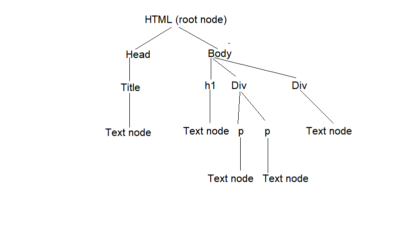

# Javascript Revision

##           Index                               ##
|**Sr. No**| **Topic Name**|
|---|       ---            | 
|1. | Javascript                      |
|2. | Adding JS to the HTML                       |
|3. | Javascript datatypes                        |
|4. | Variables, Constants, NAN and Comments      |
|5. | Short hand Notation, Ternary operator and Template string | 
|6. | Loose vs Strict Comparison|
|7. | Type Conversion |
|8. | Conditional Statements , Switch, Loops in JS |
|9. | Break and Continue |
|10.| Functions and Methods |
|11.| Arrow Function *=>* |
|12.| Callback Methods |
|13.| Date and Time object in JS |
|14.| Object literals, Array, Set, String and Map in JS |
|15.| DOM *(Document Object Manipulation)*|
|16.| Regular Expression |
|17.| More ES6 JS Features (like spread, rest etc) |
|18.| Throwing and Catching Error |
|19.| Objects and Classes in JS |
|20.| Local Storage|
|21.| Async JS |
|22.| HTTP requests, Callback functions Fetch API|
|23.| Async and Await |


## 1. JavaScript

**JavaScript** often abbreviated as **JS**, is a programming language that confirms to the **ECMAScript** specification.JavaScript is :-

- High-level
- Just-in-time compiled
- Multi-paradigm
- Dynamic typing
   
_It has curly-bracket syntax, prototype-based object-orientation, and first-class functions._

## 2. Adding JS to the HTML file

### Internal

_To write JS code in same HTML file._

```HTML
<script>
    code blocks..
</script>
```

### External

_When JS code is written in different file._

```HTML
<script src = 'JS file location with name eg. /a.js'>
</script>
```

## 3. JS Datatypes

- *Numbers* : To describe any numbers.
- *String*  : To describe any sequence of characters.
- *Boolean* : To describe True or False.
- *Null*    : Explicity set a variable with no value.
- *Undefined*: For Variables that have not yet been defined.
- *Object*   : To describe real world objects.
- *Symbol*   : To uniquely identify objects.

```JS
let age = 21;                   // Number
let lastName = "Krishna";       // String
let fullName = {firstName:"Narayan", lastName:"Krishna"};           // Object
let checkFlag = true           // Boolean
let fav                        // Undefined
let symbolOne = Symbol()       // Symbol
```
`git checkout JS_Datatypes //includes more examples in index.html`

## 4. Variables, Constants, NAN and Comments

### Variables and Constants

> var (block the use of block scope), let and const were used for storing variables.

_According to ECMA script :-_
- let   : for using variables
- const : for using constant value

### Comments

_Comments are used for describing our code._

```JS
/* Multi line 
   Comment */

// Single Line Comment
```
### NaN

>In JS **NaN** stands for **Not a Number**.

## 5. Short hand Notation, Ternary operator and Template string

- **Short hand notation** is used for assigning values.
- **Template string** is used for formatting string.
<br>_Syntax_ : 

```JS
`Sequence of characters ${variable_name}`
```
- **Ternary operator** is used to shortend conditional statement.
<br>_Syntax_ : 

```JS
Conditional statement ? code blocks if true : code blocks if false or else code blocks   
```
>Some Examples :-

```JS
// Short hand notation

/* +=, *=, /=, %= 
   eg. a+=1 is a = a+1
*/

let a = 5, b = 5
a+=1
console.log(a)
b = b+1
console.log(b)

// Template string
   let name = 'Narayan'
   let greet = `My name is ${name} and hello.`
   console.log(greet)

// Ternary Operator
   let pass = true
   pass ? 'gate open' : 'gate closed'
```

## 6.  Loose vs Strict Comparison

**Loose comparison** : _Doesn't type check and denoted by `==`_

**Strict Comparision**: _Does type check and denoted by `===`_

```JS
let age = 25

console.log(age=='25') //loose comparision

//Strict comparision
console.log(age===25) 
console.log(age==='25')
```
## 7. Type Conversion

_It is used to convert one datatype to another if possible._
<br>Examples :-

```JS
let score = '100'
let check = True
console.log(score)

//Type conversion to number
score = Number(score)
console.log(score)

//Type conversion to boolean
check = Boolean(check)
console.log(check)

//Type conversion to string
score = String(score)
console.log(score)
```
## 8. Conditional Statements , Switch, Loops in JS 

### Conditional Statements
_Syntax_ :-

```JS
if (condition){
    code block..
}

else if (condition){
    code block..
}

else {
    code block..
}
```
### Switch in JS
_Syntax_ :-

```JS
switch(variable_name){
    case 1: code block..
            break
    case 2: code block..
            break
    .
    .
    .
    case n: code block..
            break

    default: code block that always executes
            break
}
```

### Loops in JS
_To iterate elements._
_Syntax_ :-

```JS
// while loop : Iterate when condition is true

while(condition){
    code block..
}

// do while loop : Iterate at least one time wheither condition is true or not.

do{
    code block..
}while(condition)

// for loop

for (let i = start_value; i<stop_value; i++ /* jump over value */ ){
    code block..
}

// for of and for each loop

// for of loop

for (let element of arr){
    console.log(element)
}

//forEach loop

array_name.forEach(function_name /* Function that executes for every element in array_name */)
```

## 9. Break and Continue


**Break :** Break out of the loop.

**Continue :** Goes to the next iteration and also don't execute the code for ongoing iteration.

_Keywords used -_ `break` , `continue` 

## 10. Functions and Methods

### Functions 

_Functions are used to use same block of code multiple times without writing whole code again and again._

_Methods are the functions used inside the class._
_Syntax :-_

```JS
// Function Declaration

function function_name (){
    // block of codes....
}

// Function Expression

const function_name = function(){
    // block of codes
}

// Function call

function_name()
```

## 11. Arrow Function *=>*

_Arrow function is used to shortend function declaration._

_Syntax :-_

```JS
const function_name = () => {
    // code block
    return value
}
```

## 12. Callback Methods


_When function is pass as an argument to an another funtion then the function that is an argument is called callback function._

_Syntax :-_

```JS
function callback_function_name(){
    // block of code...
}

function function_name(callback_function_name){
    callback_function_name(value)
}
```

## 13. Date and Time object in JS

_To use date and time in javascript._

_Syntax :-_

```JS
const date_variable_name = new Date() // Date constructor
```

## 14. Object literals, Array, Set, String and Maps in JS

### Object literals

_Have Multiple Props (i.e multiple variables or functions)._

_Syntax :-_

```js
let object_literal_name = {
    prop_1 : '...';
    prop_2 : '...';
    .
    .
    .
}

// To access props from object literal
object_literal_name.prop_1
```

### Array

_Ordered collection of elements._

_Syntax :-_

```JS
let array_name = []

let array_name = new Array( /* no. of elements */ )

// Some array methods

array_name.length
array_name.pop()
array_name.push()
array_name.sort()
array_name.reverse()
array_name.map(function_name)
```

### String

_Sequence of characters._

_Syntax :-_

```JS
let string_name = ''

// Some methods

string_name.toUpperCase()
string_name.trim()
string_name.startsWith()
string_name.replace(s1, s2)
string_name.slice()
string_name.substr()
string_name.indexOf()
```

### Set

_Unordered collection of elements, O(1) time complexity._

_Syntax :-_

```JS
let set_name = new Set()

// Some methods

set_name.has()
set_name.add()
set_name.size
set_name.delete()
set_name.values()
```
### Map

_Mix of Array and Set, Have keys and values also override similar keys._

_Syntax :-_

```JS
let map_name = new Map()

// Some methods

map_name.get('key_name')
map_name.set('key_name', value)
map_name.delete('key_name')
map_name.size
map_name.has('key_name')
map_name.clear()
map_name.entries()
```
## 15. Document Object Manipulation

- Main Part of webpage manipulation through JS.
- Interaction with HTML through JS.
- *"document"* object

### Document Object Model



### Grabbing element through code

```JS
document.querySelector() // . represents class, # represents id 
document.querySelectorAll()
document.getElementById() // Single Element grab
document.getElementByClassName() // Multiple items of same class grab
document.getElementByTagName()

element_name.innerText = ` `
element_name.innerHTML = ` `
element_name.setAttribute('style','color : green')
element_name.getAttribute('attribute_name')
```
### HTML Collection and Node list

| HTML Collection | Node List |
|---|---|
|Collection of HTML elements | Collection of document nodes|
|Can be access through name, id, index| Can be accesed by their index number|

### Event handling

_To add functionality to events that can be mouse or keyboard event._

```JS
.addEventListener('event', function())
```
**Window object** is global object and is defaultly used.

## 16. Regular Expression

_It is used for string pattern matching._

_Example :-_

```JS
let test_ex = 'Krishna'
const pattern = /^[a-z]{6,}$/ // /-> start and end; ^-> start; [a-z]-> a to z;{ }->length; $->end;

console.log(pattern.test(test_ex))
```

## 17. More ES6 JS Features (like spread, rest )

- `rest` is used for packing or bundling of multiple variables.
- `spread` is used for unpacking ir unbundling of multiple variables.

_Syntax :-_

```JS
...variable_name // rest : converts from group of numbers to array and spread : converts from array to group of numbers

```